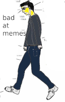

This litepaper is a work in progress. For now, it's here to illustrate a general direction, rather than a roadmap.

btw I think this version of the litepaper is too 'businessy'. But I'm also bad at memes.

# Our big opportunity
We're at such a powerful point in time.  We have new forms of economic cooperation, and so many people in the world searching for a better way to work. We can make it so work is wonderful.

!!! tip inline end "Inspiration"

    - [The Yearn Handbook]()
    - [The Valve Handbook]()
    - [Twyla Tharp's The Creative Habit]()
    - [Paul Graham's Makers / Managers Schedule]()
    - [Basecamp's How We Work]()

# Delightful by default

We have a chance to make work in DAOs *delightful by default.*

How can we shift from overwork and fomo to calm, creative collaboration? What if it was easy to see where to be useful and just start? wtf is going on that people leave corporate to join DAOS and burn out there??

Can we create environments where everyone has something wonderful to look forward to every day? 

# Cultural goals

- introducing more forms of permissionless participation
- addressing DAO collaboration in terms of human relationships first 
- recognising that collaboration tools need to extend beyond delegation, and enable more co-creation and spontaneous inspiration
- enabling high-value contributors
- recognising that visibility is a prerequisite for agency
- directly addressing Shadow Work and other forms for economic deadweight loss
- helping people who want to be conscious, self-aware and present

- 🎈 not 🚀:  Feel like you're floating in the current, rather than racing like a rocket
[And weeeee!](https://www.youtube.com/watch?v=BorQ_ULcvss)

- compete for performance not resources

- deliberate acts of empathy / giving

- Motivation and skill are the main factors of productivity.  But motivation is higher leverage.  It's easier to pump and motivated people build their skills up faster.

- dialog is a foundational level for governance, but is overlooked in most modernist views of government
- dehumanisation: burnout, fomo, vibes over people
    - conversations
    - cohorts
- barriers to entry - permissionless but overspeculated
    - scholarship
    - apprenticeship
    - tcr
- high experience, low time work
    - guild
- helping people become better dao citizens
- self-reflection
- permissionless ( people can work together without fitting a pre-described process, or working with anyone they choose, regardless of permissioned access, in or out of the DAO) structreless collaboration
    - please
    - stake
- opaque work
    - please graph

recognition that there are no objective maps of decentratlised work.  They are all relative to the individual, and depend on where you're looking from.  

>  The means of securing our trade, and therefore trust, relationships are also the means by which we can understand the network within which they operate.
Transparency is needed to help people participate, not maps.

Subsidiarity - Subsidiarity is a principle of social organization that holds that social and political issues should be dealt with at the most immediate level that is consistent with their resolution.

Pipes not walls
"organic compositions that are emergent, letting people createa n infinite garden
Auryn_macmillan - "pipethink"
https://www.youtube.com/watch?v=FAXn33_H3bA

Bath McCarthy - technical debt, cultural debt 
https://www.youtube.com/watch?v=ysaIeVbSDCo

- people feeling the need to keep up 
Olivia Commons Stack
- people quitting from not being heard

Possibliity for cultural surplus

Invisible work must become visible

# Mechanism design

!!! info inline end "References"
    - [DAOistry]()
    - [Hyperstructures]()
    - [Squad wealth]()

Cuppa will be a protocol for decentralised collaboration. It aims to be **structure-agnostic and squadratic**, enabling people to collaborate within or outside of any super-structures like DAOs. 

*[squadratic]: Focusing on small groups and teams, enabling them meritocratically with access to resources and agency.

*[structure-agnostic]: Composing well any governance super-structures, or independently, as needed.

# Design principles
To build this, Cuppa will experiment with new blockchain primitives for collaboration, focusing on:

!!! check inline end "Experimentation" 

    The nature of blockchains requires open experimentation.  

    The technical implementations benefit from open source because this allows for wide auditing and security. In terms of deployment, they are a type of Free Software, deployed as public good for anyone to access.

    The flip side of this coin is how we as people interact such economic systems. So, the only true validation and generative learning comes from trying.  Putting the work out there, and having an open mind to how people react.

Cuppa experiments are characterised by particular attention to:

- On-chain primitives. Start decentralised. Stay decentralised.
- Holistic UX.  User experience isn't just the UI layer - it's part of the DNA of the project and should be reflected right down to the smart contract calls.
- N-order effects on work culture and environment.  Every economic design has side effects, and we want to take responsibility for those by including them in our feedback loop.

> identifying impactful projects faster leads to more with retro funding - gitcoin?

# On-chain primitives

A cuppa can be calm or caffeinated. You get to choose.  Cuppa wants to give people the choice in how they connect.

Here are some primitives in mind:

## pls / ty

Working with others isn't about to-do lists, it's about requests.  

So let's start with a simple protocol that bridges on-chain records with the chats where we like to hang out.  

Pleases and thank yous recorded means easy access what you need to do, and let's others see who's doing what, who's working with who, etc.  No more DAO maps needed.  Just look at who's asking nicely.

Thank Yous also address a known hack in 

## kettle

Sometimes there's a project you know you're going to do anyway, so might as well 

## gm / gn

## cafe
pool gigabrains to 'overhear' and help

## scholarship

## onboarding cohorts - teatime

## potlach party
meme contest

## stove
As the idea progresses, everyone stakes in or out as heatmap indicator. 

## grabbable nft memberships

##  table
is a signal that you're working on something, with a set number of chairs to allow for other poeple to join you

# Onboarding 'welcoming ritual'
- recognising that we are each other's environment, and taking time to really meet each other as people to understand them, in and out of our common goals
- creating early wins, where new people feel included and confident they can contribute

