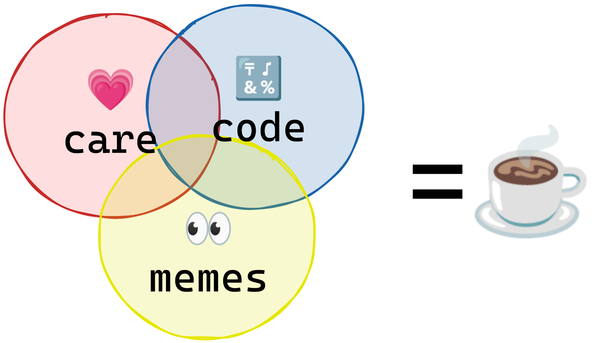

# Litepaper

## Our big opportunity
We're at such a powerful point in time.  We have new forms of economic cooperation, and so many people in the world searching for a better way to work. We can make it so work is wonderful.

So where does Cuppa come in?

- It's here to develop and test some new and interesting on-chain tools (called blockchain primitives by the cool kids) to help the DAO be joyful/humane.
- We're also scratching our own itch.  So starting as new kind of group, built a different way to create this kind of environment.
- It creates a space for fun and less formal collaboration, a place where we can hack on ideas in teams, or just with peer support. No fomo, no pressure.

### Where we help each other 🤗

We're building new kinds of interactions between people.  One of the big ideas in doing this is designing [affordances](https://www.daoistry.com/mindsets/blockchain-coordination/), meaning making something that people find intuitive. 

The most technical aspect is writing code and running it on-chain. 

The most human aspect is designing interactions that elevate human relationships and understanding. That's care.

The most social aspect is communicating a concept that is resonant and attractive.  That's memes.

Any concept we work on needs to be designed with all 3 in orchestration, bound by viable tokenomics and game theory.  When we succeed, our experiments will be communicated with memes that signal a purpose that draws people into more humane interactions with each other, consistent with the functionality exposed to each user in code. 

----

Warning: meme experiments ahead

---

### A place to try things and find your way 🧭
Imagine Cuppa like an ongoing hackathon, where you can join teams for a short period, or grab a table and get to work yourself, letting people contribute as you wish.

You can:

- check out what different hacking teams are making, play with the prototypes and help with feedback
- run your own short experiments (with a few teammates if you'd like) 
- contribute to a fabric of caring and understanding
- hang out and have fun
- make memes

!!! check "Process process process...  🤖"

    ---
        1. welcome party for you 🎉
        We meet you personally, and celebrate a new spirit in our midst

        2. async ideas riff 👀
        (relate, align, design, reduce)

        3. start making sth for a a day to a week 🛠️
        (team up if you want)

        4. learning party 🤔 📝

        5. hang and 💗 
        Everyone supports the buidlers! 🗨️🎈🤗 

We have 5-10 protocol concepts already, and will aim to reduce them to 1-day builds in scaffold-eth (with help from other hackers) and joined by teammates who'll help with memes, facilitation and game format ideas, and just vibing. So after getting these prototypes in the hands of users, observing and drawing conclusions, the overall experiments should take a week or so.

Together we'll attract like-minded people, work out what concepts resonate, and learn as we go.

Once we find the things that work, we'll double down on them, secure the protocol, call in for OG support, and this out there!

??? abstract "Personal note from Salim"

    To be totally upfront, I originally thought of Cuppa as a little project I'd just work on by myself.  

    Because these days, I just like making little software projects that I think people will like.  I think of them more as art than a way to make money, and my happiest days are when I can just be creative without distractions.

    My background is helping startups and engineers get their ideas off the ground.  I've been designing content and programs with some of the best, so feel confident in how to build products and run 'market experiments.'  But I left that world behind and am looking forward to a quieter, more monastic days.

    But like a lot of people, I really want to make the most of Kernel so feel pressure to get on a serious team with a serious project and do serious things. But when I look within, that's not what I want.  I want to be in a wolfpack with other like-minded makers.  I want to make stuff and help my friends make stuff. And have fun!

    So I  realised that Cuppa isn't really a personal project.  It wants to be a place where we can more loosely align on a this problem space, an approach to experimentation, and a collaboration culture that is itself a microcosm of the better world we're trying to build.

    So my hope is that this becomes ours, not mine, almost instantly.  As @meta_dreamer puts it so well: *we decompose it like a mycellial network, and recompose it into something better.* (Starting with this document, which is [open on github for anyone who wants to modify it.](https://github.com/saintsal/cuppa.cc/blob/main/docs/litepaper.md/edit))

    -- Salim

!!! tip inline end "Inspiration"

    - [The Blue Pill - Yearn](https://thebluepill.eth.limo/)
    - [The Valve Handbook](https://archive.org/details/ValveEmployeeHandbook)
    - [Twyla Tharp's The Creative Habit](https://www.simonandschuster.com/books/The-Creative-Habit/Twyla-Tharp/9780743235273)
    - [Paul Graham's Makers / Managers Schedule](http://paulgraham.com/makersschedule.html)
    - [Basecamp's How We Communicate](https://basecamp.com/guides/how-we-communicate)

### Delightful by default

We have a chance to make work in DAOs *delightful by default.*

How can we shift from overwork and fomo to calm, creative collaboration? What if it was easy to see where to be useful and just start? wtf is going on that people leave corporate to join DAOS and burn out there?

Can we create environments where everyone has something wonderful to look forward to every day? 

??? question "A whole bunch of questions we're asking"

    - How can DAOs be more transparent and enable more agency?

    - Fomo and burnout are serious problems.  DAO incentive systems often make people feel fungible, interchangeable and replacable.  What structural patterns can change that?  Can the fabric of DAO relationships be weaved around other things than funding and projects?

    - How can we design work collaboration and tokenomics to serve human relationships first?

    - How can we make participation more permissionless?  How can we lower institutional and economic barriers?  How can DAOs attract the talent they need and let people get right to work at their full capacity?

    - Where do we want to do the opposite, for example, enabling small teams to have more autonomy by enacting barriers?

    - What collaboration tools are useful outside of delegation use cases? What about work that benefits from spontaneous inspiration or proactive problem-solving?

    - What forms of DAO engagement can help people be conscious, self-aware and present?

    - What can we introduce to tokenised communities that naturally decompose collusion and shadow hierarchies?

    - What can we do expose shadow work and other forms of economic deadweight loss?

    - Can DAOs be learning spaces that are free from industrial modes of education like courses and content consumption?  What could learning look like if it were the natural result of interaction with other DAO participants?

    - What decentralised modes support work that requires high amounts of experience, but low amounts of time?

    - What does autonomy look like when an individual or team can reflect on their behaviour, and change their own environments to reflect the changes they want to see in themselves?

    - Why can't work be more game-like? Can we decrease the stress and increase the fun?

## A cultural foundation

!!! info inline end "References"
    - [DAOistry Mindsets](https://www.daoistry.com/mindsets)
    - [Hyperstructures](https://jacob.energy/hyperstructures.html)
    - [Squad wealth](https://otherinter.net/research/squad-wealth/)

If you're going from point A to point B, make point A as close to point B as you can.

Let's reflect on what DAOs could and should be, and start there.

- **Deliberate acts of listening and giving** We're here to support each other. 

- **Teams are ephemeral but autonomous.** We form around short experiments (1-2 weeks).  No fomo, no need to over-commit, and but enough commitment that everyone can count on their teammates.

- **Recognising each human presence** Without relationships, nobody is joining a DAO, they're just adding themselves to a database.
So the only way to grow is to literally welcome everyone in personally. To weave them into our fabric by understanding who they are as people, not just as potential contributors. Then to help them find early wins, to build confidence of where they can contribute. Onboarding isn't a funnel, it's a welcoming ritual.

- **Our environment affects our behaviour, and we are each others' environment** This means stopping to think about what communication tools we reach for, and explicitly trying new forms of collaboration that help us live our values.

- **Creative work requires autonomy over your own time** This requires a self-awareness to shift our own communication impulses towards async, because we can easily impede others autonomy by implicitly imposing on them.

- **Intersectional, and welcoming to non-web3 groups** A few groups outside of web3 will be invited to participate:

    - UX and ethnography
    - dialog facilitators
    - meme makers
    - community conveners

## Fun, fast experiments

We have ideas of what this protocol could look like, but to arrive at a viable "version 1" we need to try them, explore and adapt.  This requires wide experimentation because a successful protocol resonates on technical, social and economic levels.

!!! check inline end "Experimentation" 

    The nature of blockchains requires open experimentation.  

    The technical implementations benefit from open source because this allows for wide auditing and security. In terms of deployment, they are a type of Free Software, deployed as public good for anyone to access.

    The flip side of this coin is how we as people interact such economic systems. So, the only true validation and generative learning comes from trying.  Putting the work out there, and having an open mind to how people react.

Cuppa experiments are characterised by particular attention to:

- Holistic UX.  User experience isn't just the UI layer - it's part of the DNA of the project and should be reflected right down to the smart contract calls.
- N-order effects on work culture and environment.  Every economic design has side effects, and we want to take responsibility for those by including them in our feedback loop.
- Decentralisation-first. We prototype with on-chain primitives from the start.

??? tip "Enabling constraints"

    Embracing certain constraints can help us progress, like sticking your thumb on the end of a hose makes the water go faster.  Here are some to inspire new ways of thinking about DAOs and work in DAOs:

    - **Squadratic** - focusing on small groups and teams, enabling them meritocratically with access to resources and agency.

    - **Structure-agnostic** - Composing well any governance super-structures, or independently, as needed.

    -  **Pipes not walls** - defend autonomy by enabling inter-operability instead of blocking access.

    > "Organic compositions that are emergent, letting people createa n infinite garden"
    - [Auryn Macmillan](https://www.youtube.com/watch?v=FAXn33_H3bA_) (Gnosis)

    - **Cultural surplus and debt** - cultural debt (problems that get paid in terms of burnout, disengagement and stress) can invested into in such a way that they create cultural surpluses. - [Beth McCarthy](https://www.youtube.com/watch?v=ysaIeVbSDCo) - Toucan
    - **🎈 not 🚀** - Feel like you're floating in the current, rather than racing like a rocket. [And weeeee!](https://www.youtube.com/watch?v=BorQ_ULcvss)  What kind of communication norms and tools lead to calm, peaceful collaboration?

    - **Compete for performance not resources** - Competition is natural.  Web3 is learning how to design incentives for cooperation, but at the same time DAOs are places where people compete for resources.  Can we redesign those incentives so competitive work is mutually beneficial and less harmful?

    - **Motivation first** - Motivation and skill are the main factors of productivity.  But motivation is higher leverage.  It's easier to pump and motivated people build their skills up faster.

    - **Dialog as governance** - Dialog is a foundational for governance and mutual understanding.  It's so powerful that often dialog results in such strong alignment that voting isn't necessary. But its usually overlooked when designing governance systems.

    - **Plurality and logical decentralisation** - When you realise DAOs are a place for multiple perspectives to co-exist, you realise there can be no authorative top-down map.  Way-finding is always relative to the individual, and depends on where you're looking from.  Transparency is dependant on everyone's behaviour, not an authoritative body.

    >  Relationships are the means by which we can understand the network within which we operate.

    - **Subsidiarity and political decentralisation** - When one group makes decisions for everyone else, that's political centralisation.  Subsidiarity is a principle of social organization that holds that social and political issues should be dealt with at the most immediate level that is consistent with their resolution. Autonomy from people making their own decisions.  Opt-in instead of impose-policy.

